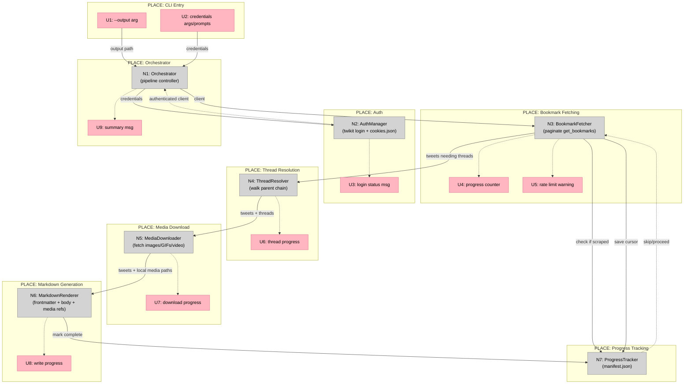

# Twitter Bookmarks Scraper — Breadboard

## UI Affordances (CLI)

| ID | Place | Affordance | Wires Out |
|----|-------|-----------|-----------|
| U1 | CLI | `--output` arg (destination folder path) | → N1 (config) |
| U2 | CLI | `--username`, `--email`, `--password` args (or prompt if missing) | → N2 (login) |
| U3 | Auth | Login status message ("Logging in..." / "Using saved session") | ← N2 |
| U4 | Fetch | Progress counter ("Fetched 40/? bookmarks...") | ← N3 |
| U5 | Fetch | Rate limit warning ("Rate limited, waiting 30s...") | ← N3 |
| U6 | Resolve | Thread resolution progress ("Resolving thread 12/85...") | ← N4 |
| U7 | Download | Media download progress ("Downloading media 24/130...") | ← N5 |
| U8 | Render | Markdown write progress ("Writing 50/200 markdown files...") | ← N6 |
| U9 | Done | Summary ("Done. 200 bookmarks saved, 130 media files, 85 threads resolved.") | ← N1 |

## Non-UI Affordances (Code)

| ID | Place | Affordance | Wires Out |
|----|-------|-----------|-----------|
| N1 | Pipeline | **Orchestrator** — runs the pipeline: auth → fetch → resolve → download → render. Reads config from CLI args. | → N2, N3, N4, N5, N6, N7 |
| N2 | Auth | **AuthManager** — `twikit.Client.login()`. Loads `cookies.json` if exists, otherwise performs fresh login and saves cookies. | → twikit API |
| N3 | Fetch | **BookmarkFetcher** — calls `client.get_bookmarks()`, loops `.next()` for pagination. 2s delay between pages. Exponential backoff on 429. Returns list of tweet objects. | → N7 (check skip), → N4 (tweets needing threads) |
| N4 | Resolve | **ThreadResolver** — for tweets with `in_reply_to`, walks parent chain via `client.get_tweet_by_id()`. Caches fetched tweets in memory dict. Returns ordered thread list per bookmark. | → twikit API |
| N5 | Download | **MediaDownloader** — iterates tweet media URLs, downloads to `{output}/media/{tweet_id}_{index}.{ext}`. Skips if file already exists. | → HTTP (media URLs) |
| N6 | Render | **MarkdownRenderer** — builds YAML frontmatter + markdown body per bookmark. Embeds thread tweets in order. References local media paths. Writes `.md` file. | → filesystem |
| N7 | Progress | **ProgressTracker** — reads/writes `manifest.json` in output folder. Tracks set of scraped tweet IDs + last cursor. `is_scraped(id)` check, `mark_scraped(id)` update, `save_cursor(cursor)`. | → filesystem |

## Wiring Diagram



**Legend:**
- **Pink nodes (U)** = UI affordances (CLI inputs/outputs the user sees)
- **Grey nodes (N)** = Code affordances (modules, handlers, services)
- **Solid lines** = Wires Out (calls, triggers, writes)
- **Dashed lines** = Returns To (return values, status messages)

## Markdown Output Format

Example output file: `bookmarks/@elonmusk-1234567890.md`

```markdown
---
author: Elon Musk
handle: "@elonmusk"
tweet_url: https://x.com/elonmusk/status/1234567890
date: 2024-03-15T14:30:00Z
likes: 45200
retweets: 8300
replies: 12400
bookmarks: 890
is_thread: true
thread_length: 3
---

# @elonmusk — Mar 15, 2024

## Tweet 1 of 3 (thread start)

This is the first tweet in the thread with some content...


---

## Tweet 2 of 3

Continuation of the thread here...

---

## Tweet 3 of 3 (bookmarked)

The final tweet that was actually bookmarked.


```

## Folder Structure

```
bookmarks/                  (--output folder)
├── media/                  (all downloaded media)
│   ├── 1234567890_0.jpg
│   ├── 1234567890_1.mp4
│   └── ...
├── manifest.json           (progress tracker state)
├── @elonmusk-1234567890.md
├── @naval-9876543210.md
└── ...
```
