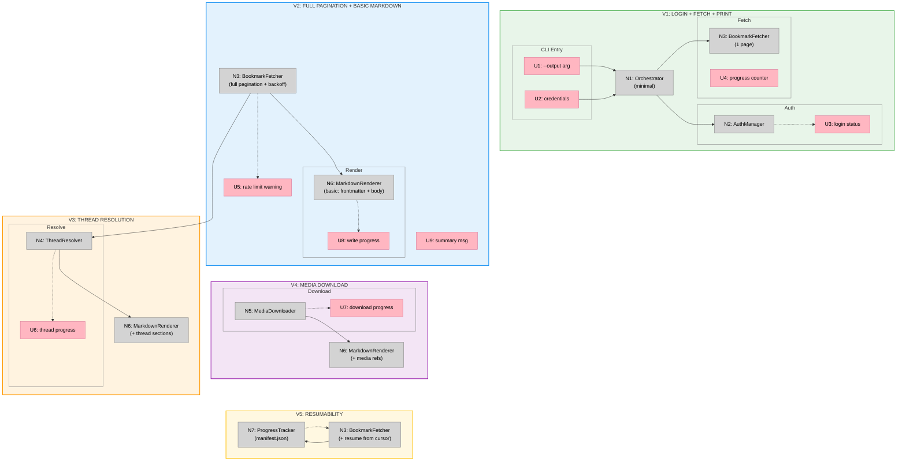

# Twitter Bookmarks Scraper — Slices

## Slice Definitions

### V1: Login + Fetch + Print

**Goal:** Prove the twikit auth and bookmarks pipeline works end-to-end.

| ID | Affordance | Notes |
|----|-----------|-------|
| U1 | `--output` arg | Folder path (created if missing) |
| U2 | Credential args/prompts | Username, email, password |
| U3 | Login status message | "Logging in..." / "Using saved session" |
| U4 | Progress counter | "Fetched 20 bookmarks..." |
| N1 | Orchestrator (minimal) | CLI parsing, calls auth then fetch |
| N2 | AuthManager | twikit login + cookies.json persistence |
| N3 | BookmarkFetcher (1 page only) | Fetch first page, print tweet IDs + text preview |

**Demo:** Run the script, see it log in, fetch first page of bookmarks, print tweet text to console.

---

### V2: Full Pagination + Basic Markdown

**Goal:** Fetch ALL bookmarks (not just first page) and write basic markdown files.

| ID | Affordance | Notes |
|----|-----------|-------|
| N3 | BookmarkFetcher (full pagination) | Loop `.next()`, 2s delay, backoff on 429 |
| U5 | Rate limit warning | "Rate limited, waiting 30s..." |
| N6 | MarkdownRenderer (basic) | Frontmatter + single tweet body, no threads, no media |
| U8 | Write progress | "Writing 50/200 markdown files..." |
| U9 | Summary message | "Done. 200 bookmarks saved." |

**Demo:** Run the script, watch it paginate through all bookmarks, see `.md` files appear in the output folder with frontmatter and tweet text.

---

### V3: Thread Resolution

**Goal:** Bookmarks that are part of threads now include the full thread in the markdown.

| ID | Affordance | Notes |
|----|-----------|-------|
| N4 | ThreadResolver | Walk parent chain via `get_tweet_by_id()`, cache in memory |
| U6 | Thread progress | "Resolving thread 12/85..." |
| N6 | MarkdownRenderer (threads) | Multi-tweet body with `## Tweet N of M` sections |

**Demo:** Open a markdown file for a bookmarked reply — see the full thread above it, properly ordered.

---

### V4: Media Download

**Goal:** Images, GIFs, and videos are downloaded locally and referenced in markdown.

| ID | Affordance | Notes |
|----|-----------|-------|
| N5 | MediaDownloader | Download to `media/{tweet_id}_{index}.{ext}`, skip existing |
| U7 | Download progress | "Downloading media 24/130..." |
| N6 | MarkdownRenderer (media) | `` references for images, links for video |

**Demo:** Open a markdown file — images render inline, video files are saved locally.

---

### V5: Resumability

**Goal:** Re-running the script skips already-scraped bookmarks and resumes pagination.

| ID | Affordance | Notes |
|----|-----------|-------|
| N7 | ProgressTracker | `manifest.json` with scraped IDs + last cursor |
| N3 | BookmarkFetcher (resume) | Load cursor from manifest, skip known IDs |
| N6 | MarkdownRenderer | Skip writing if file exists |

**Demo:** Run twice — second run completes almost instantly, printing "Skipping N already-scraped bookmarks."

---

## Sliced Breadboard

**Legend:**
- **Pink nodes (U)** = CLI inputs/outputs the user sees
- **Grey nodes (N)** = Code modules
- **Solid lines** = Calls/triggers
- **Dashed lines** = Returns/status

## Slices Grid

|  |  |  |
|:--|:--|:--|
| **V1: LOGIN + FETCH + PRINT** ⏳ PENDING  • CLI arg parsing (`--output`, creds) • twikit login + cookie persistence • Fetch first page of bookmarks • Print tweet ID + text to console  *Demo: Run script, see bookmarks printed* | **V2: FULL PAGINATION + BASIC MARKDOWN** ⏳ PENDING  • Full `.next()` pagination loop • 2s delay + exponential backoff on 429 • Basic MarkdownRenderer (frontmatter + body) • Summary message on completion  *Demo: `.md` files appear with frontmatter + text* | **V3: THREAD RESOLUTION** ⏳ PENDING  • ThreadResolver walks parent chain • `get_tweet_by_id()` with in-memory cache • MarkdownRenderer adds thread sections • `## Tweet N of M` structure  *Demo: Open reply bookmark, see full thread* |
| **V4: MEDIA DOWNLOAD** ⏳ PENDING  • Download images/GIFs/MP4 to `media/` • Name: `{tweet_id}_{index}.{ext}` • Skip existing files • `` in markdown  *Demo: Images render inline in markdown* | **V5: RESUMABILITY** ⏳ PENDING  • `manifest.json` tracks scraped IDs + cursor • BookmarkFetcher resumes from saved cursor • Skip already-scraped bookmarks • • &nbsp;  *Demo: Second run completes instantly* | |
